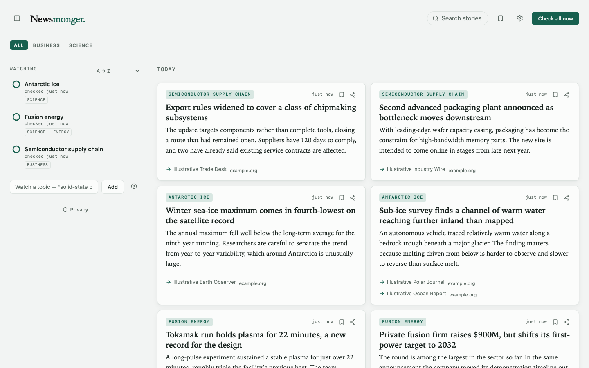
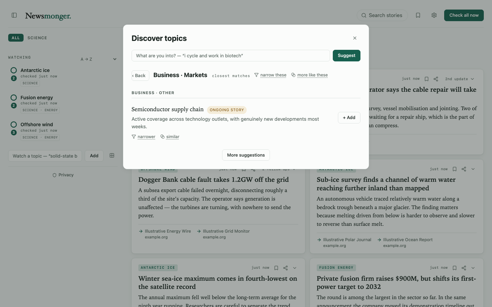
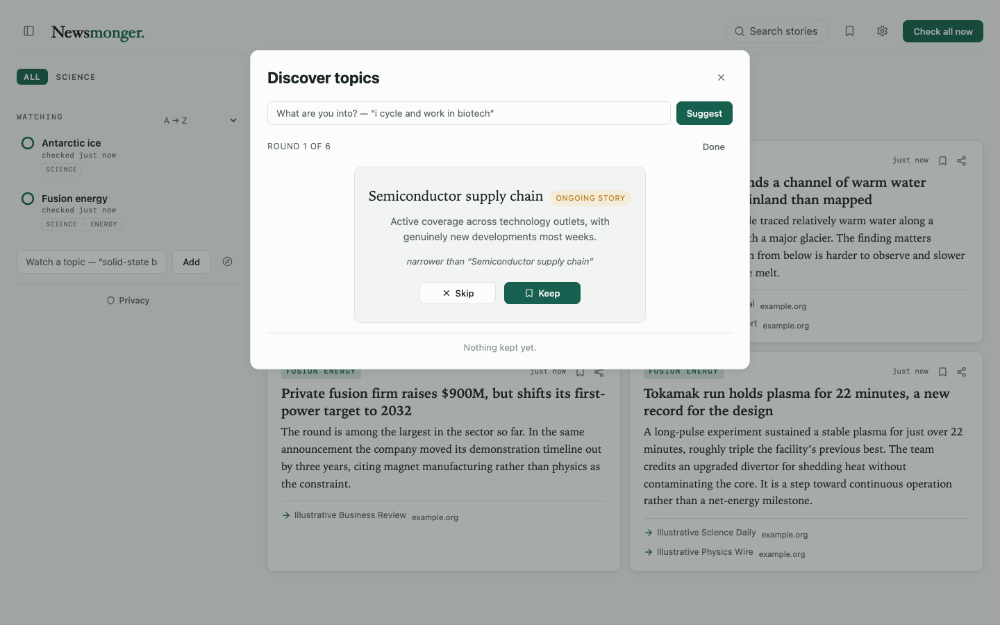
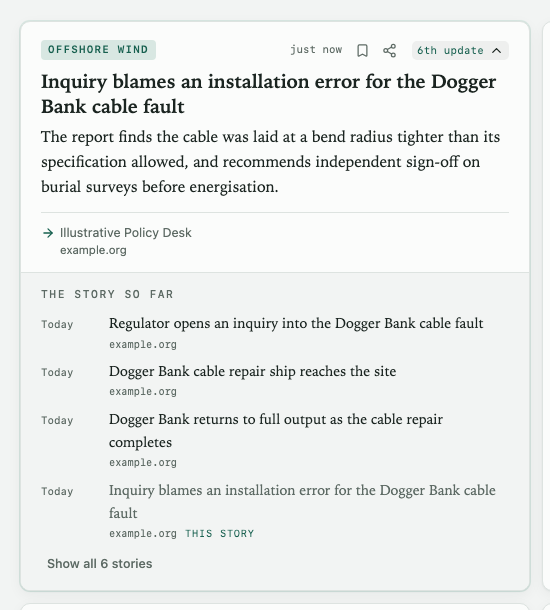
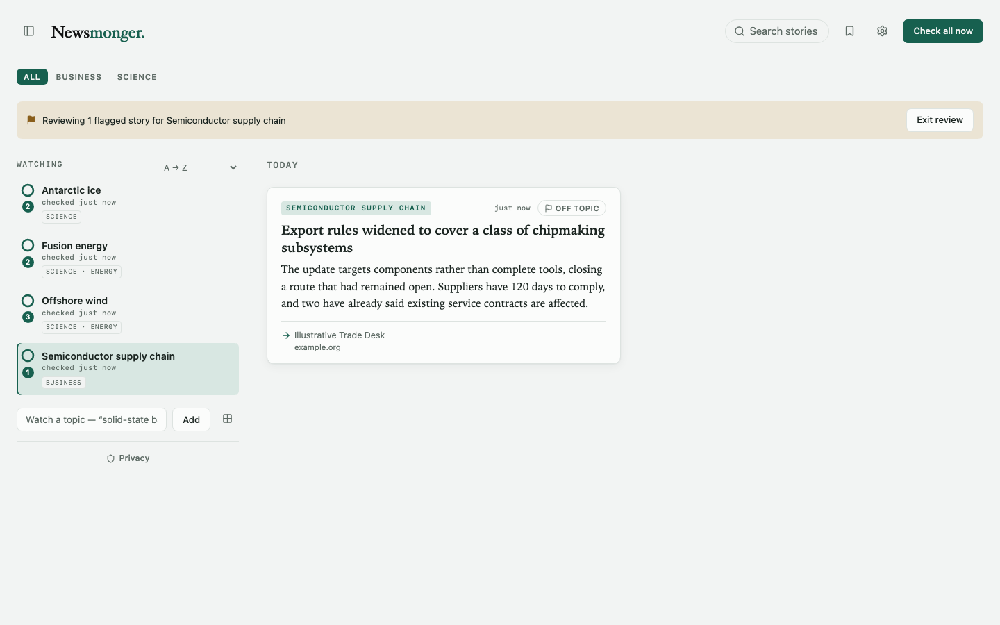
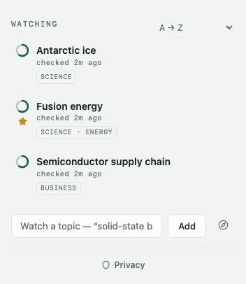
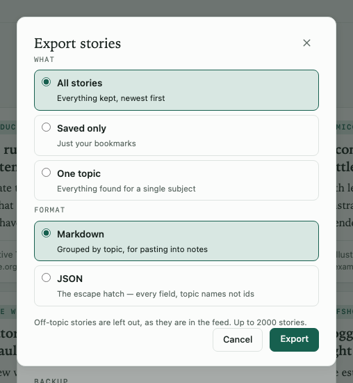
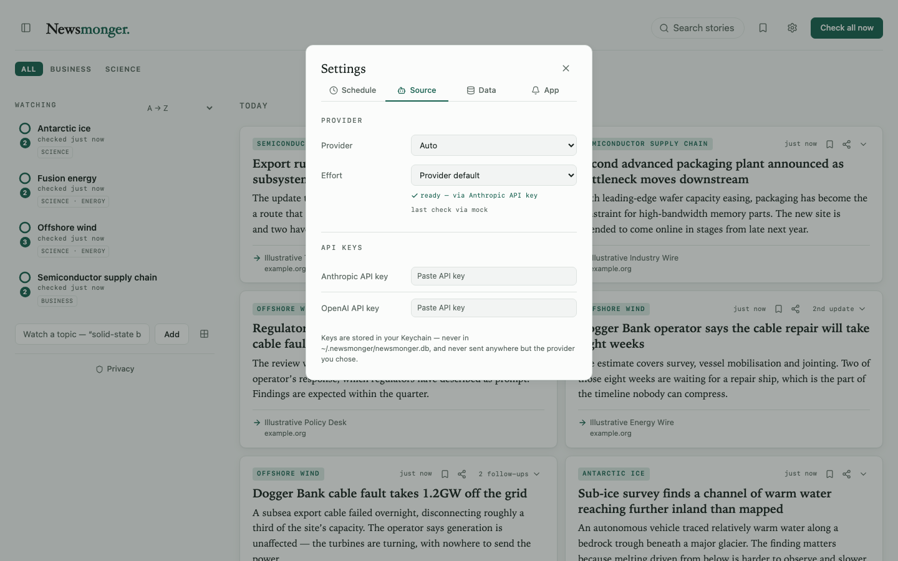

# Newsmonger


Follow topics, not feeds. Enter a list of topics and, on a schedule you pick (e.g. once a day), the app asks an AI — with live web search — whether there's anything genuinely new on each one. New stories are summarized in a feed with links to the sources; anything already reported on a previous check is deduplicated away.

Built with [kerfjs](https://github.com/brianwestphal/kerf) + Hono + Tauri (hybrid web / desktop, same architecture as glassbox).

## What it looks like



Stories arrive grouped by day, each tagged with the topic that found it and carrying links to the sources it was summarized from. A wide window lays the feed out in columns.

 

**Finding topics worth following.** Browse by section and subject, or go deeper with the keep/skip tuner — one candidate at a time, asking *narrower than this* or *more like this*, and endable at any point.



**Following a story, not just a headline.** When several stories turn out to be the same subject unfolding, they collect into a thread: a collapsed card says where it sits ("6th update"), and opening it shows how the subject got here — dated, attributed, and linked to each installment's own source. Grouping is computed locally from the stories already stored, so it costs no AI spend.



**Telling a topic what you meant.** Flag a story off-topic and it leaves the feed; review mode gathers the flagged ones for a topic, and their titles are fed back into that topic's next prompt as negative examples.

  

Every image above is a screenshot of the real app, regenerated by `npm run demo:stills` — they cannot drift from the product without the capture breaking.

## Also in the box

- **Your briefing as a feed.** Newsmonger publishes its own output at `/feed.xml` — subscribe to it in any reader, or add `?scope=saved` for just your bookmarks. Stories also export as Markdown or JSON, and both come back in: import a topic list to set up a second machine, or import a story archive and it deduplicates against what you already have.
- **Search** across every story you've collected, and bookmark the ones worth keeping.
- **Checks on your schedule** — every N hours, or at set times of day. Mark a topic high priority for a shorter interval of its own. A topic that keeps failing backs off on its own and says so rather than retrying silently.
- **Sections and subjects.** Topics are classified automatically, so the sidebar groups and the feed filters by them.
- **Light, dark, or whatever your system is doing** — chosen server-side, so there's no flash of the wrong palette on load.
- **Your data stays yours, and stays recoverable.** Back up to a folder you pick (iCloud Drive, Dropbox, anywhere) and restore from it. If a database ever fails to open, Newsmonger sets it aside rather than deleting it, tells you where it went, and offers to put it back.

## Quick start

```sh
npm install -g newsmonger
newsmonger
```

That's it — it starts the server and opens the app in your browser at `http://127.0.0.1:4187`.

**No API key needed.** If you're signed in to [Claude Code](https://claude.com/claude-code) or the [Codex CLI](https://developers.openai.com/codex/cli), Newsmonger uses that subscription — it drives the CLI you already have, so checks come out of your existing plan rather than a metered key. That's the default and the recommended way to run it. Add `--ai-test` for an offline mock, or set an API key in Settings if you'd rather pay per call.

Useful flags: `--port N`, `--data-dir PATH`, `--no-open` (don't launch a browser), `--strict-port` (fail rather than fall forward if the port is taken). `newsmonger --help` lists them all.

Data lives in `~/.newsmonger/newsmonger.db`, a SQLite database (override the directory with `--data-dir` or `NEWSMONGER_DATA_DIR`). A `data.json` left by an older build is imported automatically on first start and renamed.

## AI providers

Pick which AI finds and summarizes news, from the Source block in the UI or with `--provider` / `NEWSMONGER_PROVIDER`. Only platforms that do their own web search are supported — finding genuinely new news needs live browsing:

| Provider | Config |
|---|---|
| `auto` (default) | first available, in the order below — **subscriptions before API keys** |
| `claude-cli` | none — your **Claude subscription**, via the signed-in `claude` CLI |
| `codex-cli` | none — your **ChatGPT subscription**, via the signed-in `codex` CLI |
| `anthropic` | `ANTHROPIC_API_KEY` (Claude + web search) |
| `openai` | `OPENAI_API_KEY`, `OPENAI_BASE_URL` (Responses API + web search) |
| `mock` | offline deterministic (`--ai-test`) |

The two subscription providers are tried first on purpose: if you hold a subscription, you expect its quota spent before a key you also happen to have configured. They're **attended** — scheduled checks run only while Newsmonger is open, so it never becomes an unattended background agent on your account. Manual checks always run. See [docs/9-subscription-providers.md](docs/9-subscription-providers.md).

Seed at startup with `--provider <name> --model <id> --endpoint <url>` (or `NEWSMONGER_PROVIDER`/`NEWSMONGER_MODEL`/`NEWSMONGER_ENDPOINT`); change any time in the UI. See [docs/6-providers.md](docs/6-providers.md).

## Privacy

Newsmonger has no servers and collects no telemetry. Two kinds of data, and it's worth being precise about which is which:

**Sent to the AI provider you chose, on every check** — the topic's name, its guidance if you wrote any, the titles of stories already reported for that topic (that is how repeats are avoided), and the titles of stories you flagged off-topic (that is how it infers what you meant). Nothing else: not the feed, not your other topics, not your bookmarks.

**Stored on your machine only** — topics, the stories found, and cached article images, all under `~/.newsmonger`. **API keys are not stored there**: they go in your OS keychain (macOS Keychain, GNOME Keyring/KWallet, Windows Credential Manager), or come from an environment variable. See [docs/7-api-keys.md](docs/7-api-keys.md).

The only other outbound traffic is fetching an article's lead image (proxied through the app so your browser never talks to a news site directly — [docs/8-article-images.md](docs/8-article-images.md)) and opening links you click.

The same note is in the app, under Settings → Privacy.

## Desktop app

Newsmonger also ships as a **desktop app** — the same application in a native window, which keeps it out of a browser tab and lets it send real notifications when new stories arrive. Download it from [Releases](https://github.com/Small-Tale/newsmonger/releases): a `.dmg` for macOS (Apple Silicon and Intel, signed and notarized), a `.exe` installer for Windows, and `.deb` / `.rpm` / `.AppImage` for Linux. It updates itself: when a new version ships, the app offers to install it and asks you to restart.

All three platforms are verified end to end from the published bundle — installed, launched, the sidecar started, the real UI served, and closed without leaving a stray process behind.

## Contributing

Working on Newsmonger rather than using it? See [CONTRIBUTING.md](CONTRIBUTING.md).
